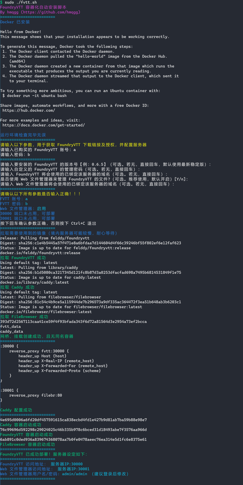

# FoundryDeploy
FoundryVTT 部署脚本



# 前置要求
- [x] 一台 Linux 服务器
- [ ] 服务器绑定域名（可选）

# MOD 安装
`v1.6.0` 版本的部署脚本发布后，使用此版脚本在 *境内服务器* 上部署 FVTT，将可直链安装 *GitHub* 上保存的 Mod、系统、世界等，无需使用其他加速方法！

升级脚本，参见下方教程。

# 使用方法

## 完整教程
[FVTT-CN 教程页](https://fvtt-cn.github.io/deployment/gettingstarted/docker/)

*如果打不开上述的 Github Pages，可以打开 Gitee 镜像*：[FVTT-CN 教程镜像](https://fvtt-cn.gitee.io/deployment/gettingstarted/docker/)

## 下载脚本
首先，如果还没有下载脚本，则下载：

*如果脚本需要更新，同样使用以下命令对**脚本**进行更新*
```bash
wget -O fvtt.sh https://fvtt-cn.coding.net/p/FoundryDeploy/d/FoundryDeploy/git/raw/master/fvtt.sh && sudo chmod +x fvtt.sh
```

## 安装
直接运行脚本即可安装：
```bash
sudo ./fvtt.sh
```

## 重启
如果需要重启容器，请运行以下命令：
```bash
sudo ./fvtt.sh restart
```

## 升级
如果要升级 FoundryVTT 版本，请运行以下命令：
```bash
sudo ./fvtt.sh remove
```
删除容器后，再运行（此处最好直接指定新的版本号，如 `0.7.9`）：
```bash
sudo ./fvtt.sh recreate
```

## 清除
如果需要清除已部署的 FoundryVTT、Caddy、FileBrowser，请运行以下命令 **（使用该命令将清除所有内容，包括 Caddy、 FVTT 所有游戏、存档、文件！）**：
```bash
sudo ./fvtt.sh clear
```

## 诊断
```bash
sudo ./fvtt.sh check
```
将会输出对 FVTT 部署的诊断结果。

# FAQ

> Q: 为什么显示安装成功后，仍然无法连接 FoundryVTT?
>
> A: 检查服务器防火墙设置。如果购买的是云服务，可以在网页控制台上检查对应端口是否开启。

> Q: 为什么不使用 Docker-Compose?
> 
> A: 避免进行更多安装步骤，国内服务器太难了。
